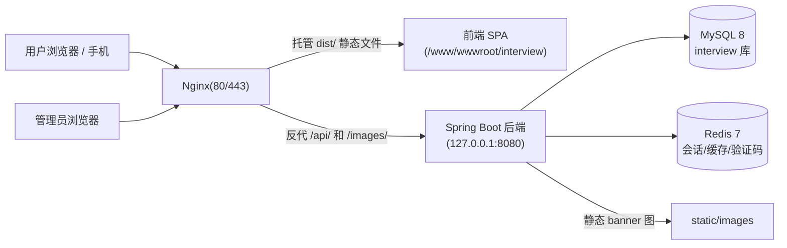

# 0-1 知识分享平台 · 部署上手指南(从零到一全流程)

> 适用读者:第一次部署、没有服务器运维经验的人。
> 本指南基于你当前项目(用户端 + 管理后台 + Spring Boot 后端)的真实情况编写,并对打包做了实测验证(见 4.3)。
> 建议照着顺序一步步做,先跑通,再优化。

---

## 目录

1. [项目现状与技术栈](#1-项目现状与技术栈)
2. [部署架构总览](#2-部署架构总览)
3. [服务器购买与选型](#3-服务器购买与选型)
4. [本地打包(前端 + 后端)](#4-本地打包前端--后端)
5. [服务器初始化与 Finalshell 连接](#5-服务器初始化与-finalshell-连接)
6. [宝塔面板安装与使用](#6-宝塔面板安装与使用)
7. [部署后端](#7-部署后端)
8. [部署前端(Nginx)](#8-部署前端nginx)
9. [域名、ICP 备案与 HTTPS](#9-域名icp-备案与-https)
10. [上线验收清单](#10-上线验收清单)
11. [常见问题排查](#11-常见问题排查)
12. [备份与日常运维](#12-备份与日常运维)
13. [后面的代码怎么办(Git 工作流)](#13-后面的代码怎么办git-工作流)
14. [配置文件体检与风险处理](#14-配置文件体检与风险处理)
15. [备注:未来规划(暂未展开)](#15-备注未来规划暂未展开)
16. [成本预估](#16-成本预估)
17. [建议时间线](#17-建议时间线)
18. [附录:常用命令速查](#18-附录常用命令速查)

---

## 1. 项目现状与技术栈

### 1.1 项目是什么

这是一个"面试题 / 知识分享"平台,包含:

- **用户端**:首页、分类浏览、题目详情(Markdown 渲染)、注册登录、个人中心、用户上传 Markdown 内容。
- **管理后台**:账号管理、内容管理(分类/题目/标签)、数据统计、操作日志、用户上传审核。

管理后台和用户端是**同一个前端项目**,只是多了 `/admin` 路由,所以**不需要部署两套前端**。

### 1.2 技术栈(部署相关的关键信息)

| 部分 | 技术 | 部署要点 |
|---|---|---|
| 前端 | Vue 3 + Vite + TypeScript + Element Plus | 构建产物 `dist/`,纯静态文件,由 Nginx 托管 |
| 后端 | Java 17 + Spring Boot 3.3.2 + MyBatis-Plus + Sa-Token | 打成可执行 jar,运行环境 JDK 必须 ≥ 17 |
| 数据库 | MySQL 8 | 注意 SQL 用了 `utf8mb4_0900_ai_ci` 排序规则,**MySQL 5.7 不支持**,必须装 8.x |
| 缓存/会话 | Redis 7 | Sa-Token 会话、缓存、验证码、浏览量都依赖它 |
| 邮件 | QQ 邮箱 SMTP(465 + SSL + 授权码) | 注册验证码 / 找回密码要用,授权码不是 QQ 密码 |
| 图片 | 4 张 banner 图在后端 `static/images`,前端写死 `/images/xxx.png`,由 Nginx 反代到后端 | 暂时够用,以后换存储方式再改 |

### 1.3 项目里的关键文件

```
0-1项目/
├── interview-backend/            # 后端(Spring Boot)
│   ├── pom.xml                   # Maven 配置,Java 17
│   ├── src/main/resources/
│   │   ├── application.yml       # 本地配置(含数据库/Redis/邮箱,不入 git)
│   │   ├── application-example.yml # 配置模板(入 git)
│   │   └── static/images/        # 4 张 banner 图
│   └── target/                   # Maven 打包产物(jar 在这里)
├── user-web/                     # 前端(Vue 3 + Vite)
│   ├── package.json
│   ├── vite.config.ts            # 开发时 /api、/images 代理到 8080
│   └── dist/                     # 前端构建产物(已存在)
└── interview.sql                 # 建库 + 建表 + 种子数据(管理员账号)
```

### 1.4 已经帮你验证过的事实(2026-08-23)

- 后端打包:**实测通过**。执行 `mvn clean package -DskipTests` 成功,产物 `interview-backend-0.1.0.jar`,大小约 **64.6 MB**。
- 前端构建产物 `dist/` 已存在,约 **5 MB / 64 个文件**。
- 前端路由是 **history 模式**(`createWebHistory()`),所以 Nginx 必须配 `try_files ... /index.html;`,否则刷新子页面 404。
- 前端请求用相对路径 `/api`,Nginx 把 `/api` 反代到后端 8080 即可,**不需要改前端代码**。
- `application.yml` **没有被 git 跟踪**,真实数据库/Redis/邮箱密码不会推到 GitHub,保持这样即可。
- 种子账号:管理员 `2090323327@qq.com / 123456`,普通用户 `2090323328@qq.com / 123456`(**上线后请立即改密码**)。
- **数据库内容目前还是空的**(只有种子账号)。你规划后续导入约 1000 篇文章:按每篇 Markdown + 渲染 HTML 约 10~30 KB 估算,总数据量只有几十 MB,MySQL 和磁盘毫无压力;真正要花时间的是**内容准备和分批导入**(见 1.5)。

### 1.5 数据库内容规划(约 1000 篇文章)

- **数据量**:1000 篇 × 10~30 KB ≈ 20~60 MB,对 MySQL 8 来说非常小;建表已有 slug 唯一索引、分类/状态/难度索引,查询性能没问题。
- **导入方式(三选一)**:
  1. 管理后台的 Markdown 批量导入(设计文档里已规划,最省事,顺带生成渲染后的 HTML);
  2. 写 SQL 脚本 insert(适合有结构化数据源);
  3. 写个一次性导入工具/接口(以后有需要再说)。
- **建议分批导入**(每批 100~200 篇),导入一批就前台抽查一批。内容变更后缓存版本号会自动 +1,前台能看到新内容,一般不需要手动清 Redis。
- **导入前先备份**当前空库(防手滑),导入后验证:`SELECT COUNT(*) FROM article WHERE status=1;`

---

## 2. 部署架构总览

一台 Linux 服务器部署如下:



要点:

- **一个前端 dist 同时服务用户端和管理后台**(`/admin` 路由),不用部署两套前端。
- **后端只在本机(127.0.0.1:8080)监听**,不对外暴露;所有外部请求先到 Nginx,再由 Nginx 转发。
- **MySQL(3306)、Redis(6379)不对外网开放**,只能服务器本机访问。

---

## 3. 服务器购买与选型

### 3.1 你的项目需要什么配置,为什么

先把这台机器上要常驻的东西列出来,估算内存:

| 组件 | 说明 | 内存占用(约) |
|---|---|---:|
| 操作系统 + 宝塔面板 | Ubuntu/CentOS 基础占用 | 0.6 ~ 1 GB |
| JDK 17 + Spring Boot jar | 建议启动参数 `-Xms256m -Xmx1g` | 1 ~ 1.3 GB |
| MySQL 8 | 数据库 | 0.5 ~ 0.8 GB |
| Redis 7 | 会话/缓存 | 0.1 ~ 0.3 GB |
| Nginx | 静态文件 + 反代 | 20 ~ 50 MB |

结论:

- **2 核 2G:能跑,但很紧。** 需要限制 JVM 内存(`-Xmx512m`)、调低 MySQL 缓冲池、加 2G swap。适合"先花最少的钱上线验证"。
- **2 核 4G:推荐起步配置。** 所有组件都放得下,还留了余量,是当前性价比最高的选择。
- **4 核 8G:等流量明显增长、或后面加新模块再升级。**

磁盘:系统盘 **40~60 GB 起步**。按你的规划(约 1000 篇文章,纯文字)数据量只有几十 MB,磁盘压力主要来自**日志和备份**,60 GB 够用很久;等以后图片量大了再考虑加数据盘或对象存储。

带宽:轻量服务器的"峰值带宽"是上限不是保底。内容站用 **4~6 Mbps 峰值 + 每月 500 GB 以上流量包**足够;初期选固定 3 Mbps 的 ECS 也够。

### 3.2 平台对比(2026 年 8 月行情,新用户价)

| 平台 | 推荐机型 | 参考价格(新用户首年) | 适合你的点 |
|---|---|---|---|
| 雨云 | **深圳电信** 2核4G / 50M / 30G+(带高防) | 约 32~58 元/月,年付七折约 270~490 元/年(以控制台实时价为准) | **你的最终选择**:国内节点 + 雨云备案;电信宽带用户延迟低 |
| 阿里云 | 轻量应用服务器 **深圳(华南1)** 2核4G / 200M 峰值 / 50~60G ESSD | 活动价约 199 元/年 | 备选:BGP 多线,移动/联通/电信访问都稳,售后好 |
| 阿里云 | ECS 经济型 e 2核2G / 3M(可选深圳) | 99 元/年(新老同价,续费同价) | 预算极紧时的稳妥选择 |
| 腾讯云 | 轻量应用服务器 **深圳(ap-shenzhen)** 2核4G / 5M / 60G SSD | 约 188~230 元/年(活动价) | 备选,同属深圳 BGP 多线 |

> 价格都是"新用户首年"活动价,续费会回到正常价。建议:
> 1. 先在腾讯云/阿里云活动页领券再下单;
> 2. 预算允许直接上 **2核4G**,省去后期折腾内存;
> 3. 学生认证还能更便宜,但同样按 2G 内存的压法来用。

> 你的决定:**雨云深圳电信 2核4G + ICP 备案**。注意深圳电信是**电信单线**:你家/主要用户是电信宽带体验最好;联通/移动用户访问会跨网、速度一般(介意就选阿里/腾讯深圳 BGP 多线)。

### 3.3 为什么这套配置适配你的项目

1. **Java 技术栈吃内存不吃 CPU**:Spring Boot 单实例 2 核足够,瓶颈在内存,所以优先保证 4G。
2. **后续加功能(每日推荐、面试模块等)主要是"加接口/加任务",对配置的压力是渐进的**,2核4G 起步、以后按需升配的路线平滑,不需要推翻重买。
3. **目标用户在国内**:选腾讯/阿里/华为的国内节点(深圳/上海/广州等)延迟低,而且能正常做 ICP 备案。不想备案只能用境外节点(香港/新加坡),延迟和稳定性都差一些,不推荐作为正式站点。

### 3.4 购买时怎么选(一步步)

以雨云深圳电信为例(阿里云/腾讯云深圳为备选):

1. 打开购买页:https://app.rainyun.com/apps/rcs/buy ,注册后进入控制台下单。
2. **区域**:选 **广东深圳(深圳电信)**(你已确定)。
3. **套餐**:选 **2核4G 中配版**(约 58 元/月,以控制台实时价为准;年付一般七折);**硬盘 40G 够用**(系统 + 环境 + 1000 篇文章大约占 15~20G,剩余留给日志;备份记得下载到本地,不够再扩);深圳节点自带高防。
4. **镜像**:选纯净 **Ubuntu 22.04 / 24.04 LTS**,然后照第 5、6 章装 Finalshell 和宝塔。
   
   > 注意:雨云的镜像列表里有**预装宝塔面板**的选项(常见是 CentOS 7.9 + 宝塔 8.0),但**不推荐用它**:版本偏旧、社区反馈 CentOS 系预装镜像有各种玄学问题(面板打不开、SSL 证书申请失败等),而且自带的 MySQL 不一定是你需要的 8.x。手动装宝塔只要 1~3 分钟。
5. 购买完成后,在控制台能看到:**公网 IP**(记下来)和**防火墙**端口页签(后面按 5.4 节放行端口)。
6. **买完马上提交 ICP 备案**:雨云控制台 → **域名备案**卡片 → 选择你的产品 ID → 进入备案流程(**试用产品不能备案**;个人备案的年龄等要求以雨云页面为准)。备案 7~20 天,越早提交越早上线。
7. 必须知道的风险(雨云 vs 阿里/腾讯):
   - **深圳电信是单线电信**:电信宽带用户访问快(河南约 25~40ms);联通/移动用户跨网访问速度一般,介意就选阿里/腾讯深圳(BGP 多线);
   - 雨云是小厂商,没有大厂那种 SLA 承诺,售后响应和稳定性口碑参差;
   - **务必做好备份**(第 12 章),重要数据每天备份到本地,不要只依赖服务器本身;
   - 以后对稳定性或联通/移动用户访问要求高了,迁到阿里/腾讯深圳即可,部署步骤不变。

#### 你已决定:雨云深圳电信 + 备案,落地注意事项

- **深圳电信到河南约 25~40ms**(电信宽带体验最好;联通/移动会跨网、稍慢);
- **备案 7~20 天,期间网站不能绑域名对外服务**:用这段时间在服务器本机验证(`curl 127.0.0.1`)、做内容录入和上线前检查(第 14 章);也可以本地 `npm run dev` 预览效果;
- **备案在雨云提交(深圳电信支持)**:雨云控制台 → 域名备案 卡片 → 选择产品 ID 进入流程;备案通过后再解析域名、绑 HTTPS 正式上线;
- **备份照旧按第 12 章执行**:小厂没有快照/容灾,"宝塔每日备份 + 定期下载到本地"必须做。

### 3.5 域名与备案(提前知道)

- **国内服务器(深圳)+ 域名 = 必须 ICP 备案**,备案一般 7~20 天。**备案通过前不要用域名对外提供服务**;可以先在服务器本机/本地开发验证。
- 域名推荐在腾讯云/阿里云买(`.cn`、`.com` 一年几十元),买完做 **A 记录解析**到服务器 IP。
- 域名 + 备案 + HTTPS 的完整流程见第 9 章。

---

## 4. 本地打包(前端 + 后端)

### 4.1 前置环境(本机 Windows)

| 工具 | 版本要求 | 说明 |
|---|---|---|
| Node.js | 18 / 20 / 22 LTS 均可 | [nodejs.org](https://nodejs.org) 下载 LTS 安装包;装完重启终端,`node -v` 能出版本号即可 |
| JDK | 17 或 21 | 你机器上 Maven 已经在用 JDK 21,打包没问题;但**运行 jar 也要 JDK 17+**(你 PATH 里的 `java` 是 1.8,直接用会报错,见 4.4) |
| Maven | 3.6+ | 你已装 Maven 3.9.8,无需再装 |

> 小提示:如果终端里 `node` 提示"不是内部或外部命令",说明 Node 没装或没进 PATH,装完重启终端即可。你项目里 `user-web/node_modules` 已存在,说明之前构建过。

### 4.2 前端打包

在 `user-web` 目录打开终端,执行:

```bash
# 1. 安装依赖(首次或 package.json 变了才需要;有 node_modules 可跳过)
npm install

# 2. 构建生产包
npm run build
```

产物:`user-web/dist/`(约 5 MB)。

**构建后要检查:**

1. `dist/index.html` 里的资源路径是 `/assets/xxx.js`(绝对路径),说明部署时必须把 dist 放在**网站根目录**(域名根路径),不能放子目录。
2. 首页 banner 图片写死为 `/images/xxx.png`,由 Nginx 反代到后端(第 8 章已配置),本地打包不用改代码。
3. 路由是 history 模式,Nginx 必须加 `try_files`(第 8 章)。

**常见问题:**

| 问题 | 解决 |
|---|---|
| `npm install` 很慢或失败 | 换国内镜像:`npm config set registry https://registry.npmmirror.com`,再重试 |
| 构建报错缺依赖 | 删掉 `node_modules` 和 `package-lock.json`,重新 `npm install` |
| 构建时内存不足(JavaScript heap out of memory) | 加环境变量:`set NODE_OPTIONS=--max-old-space-size=4096`,再 `npm run build` |
| 构建后页面图标/图片 404 | 检查是否把 dist 放到了网站根目录(而不是多套了一层目录) |

### 4.3 后端打包

在 `interview-backend` 目录打开终端,执行:

```bash
mvn clean package -DskipTests
```

产物:`interview-backend/target/interview-backend-0.1.0.jar`(约 64.6 MB,内含 Tomcat,可直接 `java -jar` 运行)。

> 我 2026-08-23 在本项目实测:**打包成功,无报错**。

**构建后要检查:**

1. `target/` 下同时出现 `.jar`(fat jar)和 `.jar.original`(瘦 jar),部署用 **`.jar`(不带 .original 那个)**。
2. 本地测试运行(注意用 JDK 17+,不要用 PATH 里的 Java 8):

```bash
"D:\Java\jdk21\jdk21\bin\java.exe" -jar target\interview-backend-0.1.0.jar
```

前提是本机 MySQL 和 Redis 已启动、密码和 `application.yml` 一致;测试完 Ctrl+C 停掉。

**常见问题:**

| 问题 | 解决 |
|---|---|
| `java -jar` 报 `UnsupportedClassVersionError` | 运行 jar 的 JDK 版本太低,必须 **17 及以上**(你 PATH 里 java 是 8,换成 JDK 17/21 的完整路径跑) |
| Maven 首次下载依赖很慢 | 在 Maven 的 `conf/settings.xml` 的 `<mirrors>` 里加阿里云镜像(见下面) |
| 打包报编码错误 / 中文乱码 | pom 已配置 UTF-8;在 IDEA 里直接点 Maven 面板的 package 最省事 |
| 8080 端口被占用 | `netstat -ano | findstr 8080` 查占用进程,关掉或改 `server.port` |
| 本地能跑,服务器上起不来 | 多半是 JDK 版本 / 数据库密码 / Redis 密码问题,见第 11 章排查表 |

阿里云 Maven 镜像(加进 `settings.xml` 的 `<mirrors>`):

```xml
<mirror>
  <id>aliyunmaven</id>
  <mirrorOf>central</mirrorOf>
  <name>阿里云公共仓库</name>
  <url>https://maven.aliyun.com/repository/public</url>
</mirror>
```

### 4.4 打包产物清单(发布时用的就是这几个)

| 产物 | 位置 | 大小 | 放到服务器哪里 |
|---|---|---:|---|
| 后端 jar | `interview-backend/target/interview-backend-0.1.0.jar` | 64.6 MB | `/www/wwwroot/interview/backend/` |
| 前端 dist | `user-web/dist/` | 5 MB | `/www/wwwroot/interview/`(根目录,不是子目录) |
| 数据库脚本 | `interview.sql` | 214 KB | 上传到服务器后导入宝塔 MySQL |

---

## 5. 服务器初始化与 Finalshell 连接

### 5.1 下载 Finalshell

- 官网:https://www.hostbuf.com/
- 下载 Windows 免费版,解压即用,不需要安装。

### 5.2 新建连接

1. 打开 Finalshell → 左上角"新建" → SSH 连接(Linux)。
2. 填写:
   - **主机**:服务器公网 IP(控制台里查)
   - **端口**:22
   - **用户名**:root
   - **密码**:购买时设置的服务器密码
3. 保存并连接。第一次连接会提示"是否信任主机密钥",点是。
4. 连接成功后左侧是文件管理器(SFTP),右侧是命令行终端。**文件可以直接拖拽上传**(后面传 jar、dist 就靠它)。

### 5.3 首次登录必做的基础设置

```bash
# 1. 看系统信息,确认系统、内存、磁盘
uname -a && free -h && df -h

# 2. 更新系统(Ubuntu/Debian 用 apt,CentOS 用 yum)
apt update && apt upgrade -y
# CentOS: yum update -y

# 3. 设置时区为上海(这是时区,和服务器地域无关;数据库/日志时间一致很重要)
timedatectl set-timezone Asia/Shanghai
timedatectl

# 4. 修改 root 密码为强密码(可选但建议)
passwd root
```

### 5.4 安全组 / 防火墙放行端口(重要)

在云厂商控制台的"安全组"(阿里云 ECS)/"防火墙"(腾讯云轻量、阿里云轻量)里放行:

| 端口 | 用途 | 建议 |
|---:|---|---|
| 22 | SSH 连接 | 必须开放(可以只对你自己的 IP 开放,更安全) |
| 80 | HTTP | 必须开放 |
| 443 | HTTPS | 必须开放 |
| 8888 | 宝塔面板默认端口 | 安装宝塔后建议改成别的,如 28888,再放行 |
| 3306 | MySQL | **不要对外开放**(后端在本机连数据库) |
| 6379 | Redis | **不要对外开放** |
| 8080 | 后端 | **不要对外开放**(Nginx 内网转发即可) |

> 原则:**公网只开 22 / 80 / 443 / 面板端口**,数据库和 Redis 永远不暴露到公网。

### 5.5 内存不足时加 swap(2G 内存必做,4G 可选)

```bash
fallocate -l 2G /swapfile
chmod 600 /swapfile
mkswap /swapfile
swapon /swapfile
echo '/swapfile none swap sw 0 0' >> /etc/fstab
free -h
```

---

## 6. 宝塔面板安装与使用

### 6.1 安装宝塔

> 说明:雨云等平台提供"预装宝塔"的镜像,但推荐**纯净系统 + 手动装宝塔**(版本最新、坑最少,还能保证 MySQL 装 8.x)。下面是手动安装命令。

在 Finalshell 终端执行(Ubuntu/Debian):

```bash
wget -O install.sh https://download.bt.cn/install/install-ubuntu_6.0.sh && bash install.sh
```

CentOS 用:

```bash
yum install -y wget && wget -O install.sh https://download.bt.cn/install/install_6.0.sh && sh install.sh
```

> 以宝塔官网 [bt.cn](https://www.bt.cn) 最新安装命令为准。安装过程约 1~3 分钟,最后会打印:
>
> ```
> 外网面板地址: http://服务器IP:8888/xxxxxx
> 面板账号: xxx
> 面板密码: xxx
> ```
>
> **立即把这三样截图保存**,后面登录要用。

### 6.2 首次登录与安全设置

1. 浏览器打开"外网面板地址"(前提是 8888 端口已在防火墙放行)。
2. 登录后:
   - 注册/绑定宝塔账号(免费);
   - **修改面板端口**:面板设置 → 安全 → 面板端口,改成比如 `28888`,然后去云控制台放行新端口、关掉旧的 8888;
   - **设置安全入口**:面板设置 → 安全 → 面板SSL/安全入口,加一串自定义后缀(类似 `?s=xxx`),避免被人扫到面板;
   - 修改面板密码。

### 6.3 安装运行环境

进入宝塔 **软件商店**,搜索安装:

| 软件 | 版本 | 说明 |
|---|---|---|
| Nginx | 1.24+ | 前端静态文件 + 反向代理 |
| MySQL | **8.0.x(不要装 5.7)** | 你的 SQL 用了 MySQL 8 专属排序规则 |
| Redis | 7.x | 会话/缓存/验证码 |
| Java 项目管理器(可选) | 免费插件 | 方便新手管理 jar,也可以不用(用第 7 章的 systemd 方式) |

> 建议装完 MySQL 和 Redis 后,先分别设置密码再继续。

### 6.4 配置 MySQL

1. 宝塔 → **数据库** → Root 密码:设置一个强密码,保存好(后面 `application-prod.yml` 要用)。
2. 数据库 → 添加数据库:
   - 数据库名:`interview`
   - 字符集:`utf8mb4`
3. **导入数据**:数据库列表 → 点 `interview` 的"导入" → 上传/选择 `interview.sql` → 执行。
   - 导入完成后点"表"标签,应能看到 `user`、`category`、`article`、`tag`、`article_tag`、`admin_log`、`daily_quote`、`user_upload`、`user_notification` 等表。
   - 验证种子账号,执行:

```sql
SELECT id, email, role, status FROM interview.user;
```

能看到管理员账号即成功。

### 6.5 配置 Redis

1. 宝塔 → 软件商店 → Redis → 设置 → 配置修改,找到并修改:

```
requirepass 你的Redis密码
```

(同时确认 `bind 127.0.0.1`,只允许本机连接。)

2. 保存并重启 Redis。
3. 终端验证:

```bash
redis-cli -a 你的Redis密码 ping
# 返回 PONG 即成功
```

### 6.6 安装/确认 JDK 17

方式一(推荐新手):软件商店搜 **Java 项目管理器** 安装,用它一键装 JDK,之后也能用它管理 jar 项目。

方式二(命令行):

```bash
# Ubuntu
apt install -y openjdk-17-jdk
# CentOS
# yum install -y java-17-openjdk
java -version   # 确认显示 17 或更高
which java      # 记住路径,后面 systemd 要用
```

### 6.7 宝塔界面速览(后面会用到)

| 菜单 | 用途 |
|---|---|
| 网站 | 创建 Nginx 站点、改配置、配 SSL |
| 数据库 | 管理 MySQL、导入 SQL、改密码 |
| 文件 | 服务器文件管理,可以网页上传/解压(替代部分 Finalshell 操作) |
| 软件商店 | 装 Nginx/MySQL/Redis/JDK 等 |
| 计划任务 | 定时备份数据库、日志清理 |
| 终端 | 网页版 SSH,临时敲命令用 |

---

## 7. 部署后端

### 7.1 准备目录与上传 jar

在 Finalshell 里执行:

```bash
mkdir -p /www/wwwroot/interview/backend
```

把 `interview-backend-0.1.0.jar` 从本地**拖拽上传**到 `/www/wwwroot/interview/backend/`(64 MB 传一会儿,看 Finalshell 底部进度)。

### 7.2 创建生产配置文件(关键)

后端默认读 `application.yml`(开发配置)。生产环境建议单独建 `application-prod.yml`,不改源码、不污染 git:

在 `/www/wwwroot/interview/backend/` 下新建 `application-prod.yml`(宝塔文件编辑,或 Finalshell 里 `vi`),内容:

```yaml
server:
  port: 8080

spring:
  application:
    name: interview-backend
  datasource:
    url: jdbc:mysql://127.0.0.1:3306/interview?useUnicode=true&characterEncoding=UTF-8&useSSL=false&allowPublicKeyRetrieval=true&serverTimezone=Asia/Shanghai
    username: root
    password: 你的MySQL密码
    driver-class-name: com.mysql.cj.jdbc.Driver
  data:
    redis:
      host: 127.0.0.1
      port: 6379
      password: 你的Redis密码
      database: 0
      timeout: 5s
      lettuce:
        pool:
          max-active: 16
          max-idle: 8
          min-idle: 2
  mail:
    host: smtp.qq.com
    port: 465
    username: 2090323327@qq.com
    password: 你的QQ邮箱SMTP授权码
    default-encoding: UTF-8
    properties:
      mail:
        smtp:
          auth: true
          ssl:
            enable: true
  servlet:
    multipart:
      max-file-size: 10MB
      max-request-size: 100MB

app:
  code:
    ttl-minutes: 5
    max-tries: 5
    resend-seconds: 60
    daily-limit: 10
    mock: false
  view:
    flush-interval-ms: 60000

mybatis-plus:
  configuration:
    map-underscore-to-camel-case: true
    log-impl: org.apache.ibatis.logging.nologging.NoLoggingImpl
  global-config:
    banner: false
    db-config:
      id-type: auto

sa-token:
  token-name: Authorization
  timeout: 2592000
  active-timeout: -1
  is-concurrent: true
  is-share: false
  max-login-count: 3
  token-style: uuid
  is-log: false

logging:
  level:
    com.interview: info
```

和开发配置的差别(解释一下,方便以后自己改):

| 项 | 原因 |
|---|---|
| 数据库/Redis 密码 | 用你自己设的强密码 |
| `log-impl` 改成 `NoLoggingImpl` | 生产环境不打印每条 SQL,日志干净、性能好 |
| `app.code.mock: false` | 生产发**真实邮件**(QQ SMTP 授权码),验证码才收得到 |
| 邮箱授权码 | 在 QQ 邮箱 → 设置 → 账户 → 开启 SMTP 服务 → 生成授权码(不是 QQ 密码) |

> 安全提醒:这个文件**只放服务器上,不要提交到 git**。你项目里 `application*.yml` 已在 `.gitignore` 中排除,保持即可。

### 7.3 启动方式二选一

#### 方式 A(推荐):systemd 服务,开机自启、崩溃自动拉起

在服务器上创建 `/etc/systemd/system/interview.service`:

```bash
cat > /etc/systemd/system/interview.service <<'EOF'
[Unit]
Description=Interview Backend
After=network.target mysql.service redis.service

[Service]
WorkingDirectory=/www/wwwroot/interview/backend
ExecStart=/usr/bin/java -Xms256m -Xmx1024m -jar /www/wwwroot/interview/backend/interview-backend-0.1.0.jar --spring.profiles.active=prod
Restart=on-failure
RestartSec=10
SuccessExitStatus=143

[Install]
WantedBy=multi-user.target
EOF
```

> 如果 `which java` 的路径不是 `/usr/bin/java`(比如宝塔装的 JDK 在 `/www/server/java/...`),把 `ExecStart` 里的 java 换成实际路径。

然后:

```bash
systemctl daemon-reload
systemctl enable interview          # 开机自启
systemctl start interview           # 启动
systemctl status interview          # 看状态(绿色 active 即成功)
journalctl -u interview -f          # 实时看日志(Ctrl+C 退出)
```

#### 方式 B(临时/调试用):nohup 后台运行

```bash
cd /www/wwwroot/interview/backend
nohup /usr/bin/java -Xms256m -Xmx1024m -jar interview-backend-0.1.0.jar --spring.profiles.active=prod > app.log 2>&1 &
tail -f app.log
```

> 方式 B 服务器重启后要手动再启动,所以正式环境建议用方式 A。

### 7.4 验证后端

在服务器终端:

```bash
curl http://127.0.0.1:8080/api/home/overview
```

返回类似 `{"code":200,"message":"ok","data":{...}}` 即成功。

再验证图片:

```bash
curl -I http://127.0.0.1:8080/images/ai-banner.png
```

返回 `200 OK` 即成功。

> 注意:8080 不需要也不应该对公网开放,上面验证用的是服务器本机 127.0.0.1。

---

## 8. 部署前端(Nginx)

### 8.1 创建站点

宝塔 → 网站 → 添加站点:

- 域名:填你的域名(没有域名先填服务器 IP,后面解析好再改)
- 根目录:`/www/wwwroot/interview`(会自动创建)
- PHP 版本:**纯静态**(不需要 PHP)

### 8.2 上传 dist

把本地 `user-web/dist/` 里的**内容**(`index.html`、`assets/`、`logo.png`、`favicon.svg`)上传到 `/www/wwwroot/interview/` 根目录,不要再多套一层目录。

> 用 Finalshell 直接拖拽,或者先把 dist 打成 zip 传到服务器,在宝塔文件里右键解压,再确认最终结构是 `/www/wwwroot/interview/index.html`。

### 8.3 配置 Nginx(最关键的一步)

宝塔 → 网站 → 你的站点 → 设置 → 配置文件,整段替换为:

```nginx
server
{
    listen 80;
    server_name 你的域名或IP;
    index index.html;
    root /www/wwwroot/interview;

    # 前端 SPA:history 路由回退到 index.html(不配置,刷新子页面就 404)
    location / {
        try_files $uri $uri/ /index.html;
    }

    # 后端 API 反代
    location /api/ {
        proxy_pass http://127.0.0.1:8080;
        proxy_http_version 1.1;
        proxy_set_header Host $host;
        proxy_set_header X-Real-IP $remote_addr;
        proxy_set_header X-Forwarded-For $proxy_add_x_forwarded_for;
        proxy_set_header X-Forwarded-Proto $scheme;
        proxy_connect_timeout 10s;
        proxy_read_timeout 60s;
    }

    # 后端静态图片反代(当前 4 张 banner 在后端 jar 里)
    location /images/ {
        proxy_pass http://127.0.0.1:8080;
    }

    # 静态资源缓存 30 天
    location ~* \.(js|css|png|jpg|jpeg|gif|svg|webp|ico|woff2?)$ {
        expires 30d;
        add_header Cache-Control "public, no-transform";
    }

    # 压缩
    gzip on;
    gzip_min_length 1k;
    gzip_comp_level 5;
    gzip_types text/plain text/css application/javascript application/json image/svg+xml;
    gzip_vary on;

    access_log /www/wwwlogs/interview.log;
    error_log /www/wwwlogs/interview.error.log;
}
```

保存后点"重载配置"(或终端执行 `nginx -t && nginx -s reload`)。

### 8.4 前端验证

浏览器打开 `http://服务器IP/`:

1. 首页应正常显示,轮播图(banner)能加载;
2. 点进任意题目详情页,再**刷新**,不应 404(验证 history 回退生效);
3. 打开 `http://服务器IP/admin`,用管理员账号 `2090323327@qq.com / 123456` 登录,管理后台能打开;
4. 登录成功、能发布/编辑内容,说明 `/api` 反代正常;
5. 邮箱验证码能收到(需要 QQ 授权码正确)。

---

## 9. 域名、ICP 备案与 HTTPS

### 9.1 域名购买与解析

1. 在腾讯云/阿里云买域名(如 `example.com`),首次几十元/年。
2. 域名解析(DNS)添加 **A 记录**:
   - 主机记录:`@`(根域名)和 `www`
   - 记录值:你的服务器公网 IP
   - 解析生效一般几分钟到几小时。
3. 把宝塔站点 `server_name` 改成域名,并**同时绑定 `www.域名` 和 `域名`**。

### 9.2 ICP 备案(国内服务器必须)

- 在云厂商控制台找"ICP 备案"入口,按提示提交:
  - 主体信息(身份证/手机号/居住地址)
  - 网站信息(网站名称、服务内容)
  - 需要**人脸核验**,部分省份需要幕布/拍照
- **雨云深圳电信备案方式**:雨云控制台 → 域名备案 卡片 → 选择产品 ID 进入备案流程(**试用产品不能备案**;个人备案的年龄等要求以雨云页面为准)。
- 周期约 7~20 天,期间网站**不能**用域名对外服务;建议在服务器本机 `curl` 验证,或本地开发,别把未备案网站挂到公网。
- 备案通过后,短信/邮件通知,把备案号放到网站底部(常见做法)。

> 备案期间建议:
> 1. 在服务器本机 `curl 127.0.0.1:8080` 验证后端,内容录入、上线前检查照常做;
> 2. 想预览效果用本地 `npm run dev`(备案通过后再正式上线);
> 3. **不要用域名或公网 IP 对外提供网站服务**,等备案通过再正式上线。

### 9.3 HTTPS(SSL)

宝塔 → 网站 → 你的站点 → SSL:

1. 确认域名已解析到本机、80 端口可访问;
2. 点 **Let's Encrypt 免费证书** → 勾选域名 → 申请;
3. 申请成功后点"开启强制 HTTPS";
4. 宝塔会自动续期(Let's Encrypt 有效期 90 天,面板到期前自动续)。

开启 HTTPS 后,上面的 Nginx 配置会多出 443 的 server 块,`/api`、`/images` 的反代规则自动沿用,不用改。

---

## 10. 上线验收清单

发布后按下面逐项过一遍:

- [ ] `http://域名/` 首页打开,轮播图加载
- [ ] 分类页面、题目列表、题目详情可访问,详情页刷新不 404
- [ ] Markdown 渲染正常、代码高亮正常、TOC 正常
- [ ] 注册新账号(邮箱验证码能收到)、登录、退出正常
- [ ] 修改密码、找回密码正常
- [ ] 管理后台 `/admin` 登录正常
- [ ] 后台能增删改分类/题目/标签,发布后前端可见
- [ ] 用户上传 Markdown,后台能看到并回复
- [ ] 浏览量统计有变化(Redis + 定时落库)
- [ ] `curl -I https://域名/images/ai-banner.png` 返回 200
- [ ] 手机浏览器打开,基本可用
- [ ] 数据库和 Redis 已设强密码、3306/6379 未对公网开放
- [ ] 宝塔面板端口已改、安全入口已设置
- [ ] 上线后修改管理员和种子用户密码

---

## 11. 常见问题排查

| 症状 | 可能原因 | 解决 |
|---|---|---|
| 首页能开,接口全部 502 | 后端没启动,或 Nginx 反代地址/端口不对 | `systemctl status interview`、`curl 127.0.0.1:8080/api/home/overview`;检查 nginx 配置 |
| 刷新子页面 404 | Nginx 缺 `try_files $uri $uri/ /index.html;` | 按 8.3 配置 |
| 图片 404 | `/images` 没反代 | 检查 nginx `location /images/` |
| 导入 SQL 报 `utf8mb4_0900_ai_ci` 错误 | MySQL 装了 5.7 | 必须用 **MySQL 8.x** 重装/重导 |
| `java -jar` 报 UnsupportedClassVersionError | JDK 版本低于 17 | `apt install openjdk-17-jdk`,`java -version` 确认 |
| 启动日志报 Redis 认证失败 | `requirepass` 与 `application-prod.yml` 不一致 | 改 Redis 配置或 yml,重启两者 |
| 登录提示"账号不存在" | 数据库没导入或连错库 | 宝塔里查 `interview.user` 表是否有数据;确认 yml 库名是 `interview` |
| 邮箱验证码收不到 | 授权码错误 / 465 未开 SSL / 邮箱没开 SMTP | QQ 邮箱设置里重新生成授权码;确认 yml 的 mail 配置 |
| 后台登录后马上 401 | Sa-Token 会话在 Redis,Redis 重启后 token 失效 | 重新登录即可;如频繁发生检查 Redis 是否稳定 |
| 页面白屏 | dist 放错位置 / 资源路径不对 | 看浏览器 F12 Console;确认 `/www/wwwroot/interview/index.html` 存在且资源是 `/assets/...` |
| 服务器内存被打满、jar 被杀 | JVM 内存太大或内存不足 | `-Xmx512m`、加 swap、升级配置 |
| 宝塔面板打不开 | 端口没放行 / 面板端口改了 | 云控制台放行新端口;`/etc/init.d/bt default` 查面板信息 |
| 改了代码重新部署后还是旧版 | 浏览器缓存了旧静态资源 | 强制刷新(Ctrl+F5);带 hash 的静态资源会自动更新,index.html 不要长缓存 |
| `nginx -t` 报语法错误 | 配置文件写错 | 对照 8.3 示例逐行检查,重点看分号和括号 |

---

## 12. 备份与日常运维

### 12.1 定时备份数据库(最重要的备份)

宝塔 → 计划任务:

- 任务类型:**备份数据库**
- 数据库:选 `interview`
- 执行周期:**每天 03:00**
- 备份保留:7 份

也可以直接用 Shell 脚本(更可控):

```bash
#!/bin/bash
# 每天凌晨备份,保留 14 天
mysqldump -uroot -p'你的MySQL密码' interview > /www/backup/interview_$(date +%F_%H%M).sql
find /www/backup -name "interview_*.sql" -mtime +14 -delete
```

> `mysqldump` 路径一般在 `/www/server/mysql/bin/mysqldump`,宝塔计划任务的 Shell 脚本里可以直接写脚本名。

> 如果你用雨云这类小厂商:一般**没有自动快照/异地容灾**,所以"宝塔每日备份 + 每周把备份下载到本地电脑(Finalshell 直接拖下来)+ 有条件再同步一份到网盘/对象存储"这条要严格执行。

### 12.2 备份网站文件

计划任务 → 备份网站 → 选 `interview` 站点 → 每周一次,保留 4 份。

### 12.3 日志查看

```bash
# 后端日志(systemd 方式)
journalctl -u interview -f

# 后端日志(nohup 方式)
tail -f /www/wwwroot/interview/backend/app.log

# Nginx 访问/错误日志
tail -f /www/wwwlogs/interview.log
tail -f /www/wwwlogs/interview.error.log
```

### 12.4 日常升级发布流程(重点,记住这条线)

改完代码要发布时:

1. **本地**打好包:
   - 前端:`cd user-web && npm run build`
   - 后端:`cd interview-backend && mvn clean package -DskipTests`
2. 用 Finalshell 把新的 `dist` 和 jar 传到服务器(覆盖旧文件)。
3. 重启后端:

```bash
systemctl restart interview
```

4. 前端是静态文件,覆盖后刷新浏览器即可(必要时 `nginx -s reload`)。
5. 按第 10 章抽查关键功能。

> 建议把"重启"做成一个脚本放服务器上,减少手滑:

```bash
# /root/deploy.sh
systemctl restart interview
nginx -t && nginx -s reload
echo "deploy done"
```

---

## 13. 后面的代码怎么办(Git 工作流)

### 13.1 你现在的仓库情况

- 远程仓库:`https://github.com/UserLcl888/Mianshi-`(分支 `main`)
- `.gitignore` 已经正确排除了:`node_modules`、`dist`、`target/`、`application*.yml`(除了 example 模板)——所以**打包产物和真实密码都不会进仓库**,这是对的。

### 13.2 日常开发流程(现在就照这个做)

```bash
# 1. 在项目根目录
git add .
git commit -m "描述这次改了什么"
git push origin main
```

发布时按 12.4 的流程:本地打包 → 上传服务器 → 重启。**服务器上不需要装 Node/Maven、不需要放源码**,只放产物,简单、安全、不容易出错。

### 13.3 代码管理注意事项

1. **不要提交真实密码**:`application-prod.yml` 只放服务器。开发用的 `application.yml` 已被 git 排除,保持。
2. **数据库结构变更要沉淀到 `interview.sql`**:每次改了表结构,同步更新这个文件并提交,服务器重导/新环境初始化才不会乱。
3. **提交信息写清楚**:`git commit -m "修复登录验证码 60 秒重发问题"` 比 "update" 好一百倍。
4. **重要改动先拉分支**:`git checkout -b feature/xxx`,测好再合并回 main。
5. **上线前备份**:大改动前先做一次数据库备份(12.1)。

### 13.4 以后想自动发布(进阶,以后再说)

现在阶段**不建议**一上来搞 CI/CD,先把手动流程跑顺。之后可以二选一:

- **GitHub Actions**:push 到 main 后自动构建,把产物传到服务器并重启;
- **服务器上直接构建**:在服务器装 Node 和 Maven,`git pull → 构建 → 重启`。

---

## 14. 配置文件体检与风险处理

### 14.1 配置文件逐个体检(结论:整体干净,但有 3 个要处理)

| 文件 | 是否入 git | 体检结论 | 处理 |
|---|---|---|---|
| `interview-backend/src/main/resources/application.yml` | 否(已被 .gitignore 排除) | **注意**:里面是真实开发密码(MySQL `rootlcl`、Redis `java`)和 **QQ 邮箱授权码**,只适合本地开发 | 保持不入库;本机别乱分享/截图/同步到网盘;生产用 `application-prod.yml`(见 7.2) |
| `application-example.yml` | 是 | 干净,全是占位符;已补齐 mail / 上传大小 / 验证码参数(2026-08-23) | 保持不变,给新环境当模板 |
| `user-web/.env.development` / `.env.production` | 是 | 当前是空文件;前端请求走相对路径 `/api`,**本来就不需要**环境变量 | 可以留着;以后如果加 `VITE_` 变量,记住前端变量是公开的,**绝不放密钥** |
| `user-web/vite.config.ts` | 是 | 只有开发代理配置,无风险 | 无需处理 |
| `pom.xml` | 是 | 无敏感信息 | 无需处理 |
| `interview.sql` | 是 | 含种子账号、**明文密码列**(`rootpassword=123456`)、真实 QQ 邮箱;脚本是"先 DROP 再建" | 上线后立即改管理员密码;**生产环境不要重复执行这个文件**(会清库);明文密码按你的决定保留在数据库,但**已不再返回前端**(见 14.2) |
| `.gitignore` | 是 | 已正确排除 `node_modules` / `dist` / `target` / `application*.yml`;已加 `.env`(2026-08-23) | 保持不变 |

### 14.2 当前最该处理的 3 件事

1. **QQ 邮箱授权码是真实敏感信息**:它现在写在本地 `application.yml` 里。授权码可以代替密码发信,如果泄露,别人能用你的邮箱发垃圾/钓鱼邮件。建议:开发环境把 `app.code.mock` 改成 `true`(验证码只打印日志),生产用另一个专用授权码,或至少定期到 QQ 邮箱重置。
2. **上线立刻改种子账号密码**:`interview.sql` 里管理员和用户密码都是 `123456`。明文密码按你的决定**只保留在数据库 `rootpassword` 列**(方便前期登录调试),但**已不再返回给前端**(2026-08-23 已修改:删除了 `VOs.UserVO.rootPassword` 字段和 `toVO` 里的赋值,数据库写入保持不变);上线后第一时间把 `123456` 改掉。
3. **生产环境必须用 `application-prod.yml` 启动**:默认 `application.yml` 里 `log-impl` 会打印每条 SQL、`mock: false` 会发真邮件。用 `--spring.profiles.active=prod` 启动(第 7 章已这样做)就都没有问题。

### 14.3 其他你可能没想到的问题(已帮你排查)

1. **`interview.sql` 会 DROP 表**:脚本开头是 `DROP TABLE IF EXISTS`,在**生产库上重复执行会清空所有数据**。只在首次初始化时执行,以后只导增量数据。
2. **数据库现在是空的**:内容导入建议分批(见 1.5),导入后抽查前台是否正常刷新(缓存版本号机制会自动失效,一般不用手动清 Redis)。
3. **你本机 PATH 里的 `java` 是 1.8**:跑 jar 会报 UnsupportedClassVersionError。建议装一个 JDK 17+ 并配置 `JAVA_HOME`,免得 IDEA 里能跑、命令行跑不了。
4. **HTTPS 之后的"混合内容"**:以后如果图片地址用了 `http://` 的外部资源,https 页面会被浏览器拦截。当前图片走同域反代没问题;以后接对象存储记得用 https 域名。
5. **日志会一直增长**:systemd 的 journal 默认可能占不少磁盘。建议限制:`journalctl --vacuum-size=200M`,或改 `/etc/systemd/journald.conf` 里 `SystemMaxUse=200M` 后 `systemctl restart systemd-journald`。
6. **雨云等小厂商一般没有自动快照**:别把"服务器本身"当唯一备份,严格执行第 12 章(宝塔定时备份 + 定期下载到本地)。
7. **被刷/攻击防护**:登录已有 Redis 限流(5 次/分钟)、验证码每日限 10 次,基本够用;以后流量上来或被人 CC,雨云可以买高防,腾讯/阿里有免费 DDoS 基础防护。
8. **QQ 邮箱发信有每日上限**:大量用户注册时可能被限流。当前"单邮箱每日 10 次验证码"的限制已经比较保守,问题不大;用户多了建议用专用发信服务(阿里云邮件推送等)。
9. **数据库备份很小也要异地**:1000 篇文章的 SQL 备份可能就几十 MB,但"服务器被删库/硬盘损坏"这种极端情况,只有异地备份能救。
10. **域名解析后记得在宝塔站点里同时绑定 `www.域名` 和 `域名`**,否则其中一个访问 404 或证书不匹配。
11. **上线前用 `http://IP/` 验收时浏览器会提示"不安全"**:这是正常的,配好域名 + HTTPS 后消失。

### 14.4 上线前还需要改的代码问题(本次代码排查新增)

这一节是 2026-08-23 逐行看代码后发现的问题,按严重程度排序:

1. **游客访问内容会被弹去登录(严重,和你"知识分享"定位冲突)**
   - 现状:`SaTokenConfig.java` 的登录拦截白名单只有登录/注册/验证码/首页/分类树,`/api/articles`(列表、详情)和 `/api/articles/{id}/view`(浏览量上报)**不在白名单里**,而 `ArticleController` 也没有放行注解。游客打开分类页/详情页时,接口返回 401,前端 `request.ts` 会自动跳转登录页。
   - 但你的前端路由(分类页、详情页)本身是允许游客访问的,设计文档也说"游客只读浏览公开内容"——**代码和设计不一致**。
   - 建议:如果想让游客直接看(推荐),在 `SaTokenConfig` 白名单里加 `/api/articles` 和 `/api/articles/**`(浏览量上报 `POST /api/articles/{id}/view` 也一并放行,否则游客的浏览量不计);管理端 `/api/admin/**` 已有 `@SaCheckRole("ADMIN")`,不受影响。
2. **明文密码不再返回前端(已修改)**
   - 原问题:`AuthService.toVO()` 把明文密码塞进返回体,`VOs.UserVO` 有 `rootPassword` 字段,登录/个人资料接口的 JSON 里带着明文密码,还会被写进浏览器 localStorage——任何 XSS 或本机泄露都能直接拿到用户密码。
   - **已修改(2026-08-23)**:删除 `VOs.UserVO.rootPassword` 字段和 `AuthService.toVO()` 里的赋值,重新打包验证通过。按你的决定,**明文密码仍写入数据库 `rootpassword` 列**(方便前期登录调试),但接口返回体里不再出现。前端本来就没用这个字段,所以前端零改动。
3. **管理端 Markdown 批量导入还没实现(影响 1000 篇录入效率)**
   - 现状:`AdminArticleController` 只有列表/新增/编辑/排序/删除,设计文档里规划的"Markdown 批量导入"接口不存在。1000 篇文章如果全靠后台一条条手工录入不现实。
   - 建议二选一:① 给管理端加一个"批量导入 .md 文件"的接口和页面(后端解析 frontmatter + 渲染 HTML,前端拖拽上传);② 先把内容整理成结构化数据,写一次性 SQL 脚本导入(注意 `content_html` 也要生成,不能只导 Markdown)。
4. **开发环境会发真实邮件(建议改)**
   - 本地 `application.yml` 里 `app.code.mock: false`,验证码会真的通过 QQ 邮箱发出去。开发时建议改成 `true`(只打印日志),生产再开真邮件(第 7.2 章 prod 配置里是 `false`)。
5. **已验证没问题的部分(不用改)**
   - 管理接口全部有 `@SaCheckRole("ADMIN")`,普通用户调不了;
   - Markdown 渲染有 OWASP 消毒,前端展示还有 DOMPurify 二次兜底;
   - 浏览量是 Redis 聚合 + 定时落库,不写放大;
   - 登录有 Redis 限流(1 分钟 5 次)、验证码有次数/频率/每日上限;
   - 打包实测通过,`application.yml` 未入库。

---

## 15. 备注:未来规划(暂未展开)

你提到后面会加的功能(每日推荐 / 类似 GEO 的非传统 SEO / 面试模块 / 图片存 MinIO / 可能微服务化),以及对应的服务器配置演进、技术选型,等你有时间了我们再作为**第 15 章之后的内容**补充进这份文档。当前先按现在的项目形态把部署跑通。

---

## 16. 成本预估

| 项目 | 金额 | 说明 |
|---|---:|---|
| 服务器 2核4G(**雨云深圳电信**) | 约 32~58 元/月,年付七折约 270~490 元/年 | 你的最终方案;以控制台实时价为准 |
| 服务器 2核4G(阿里云/腾讯云 **深圳**,备选) | 约 199~298 元/年 | BGP 多线,联通/移动访问更稳 |
| 服务器 2核2G(预算方案,阿里 ECS 经济型 e) | 99 元/年 | 需要压内存、加 swap |
| 域名 | 首次约 30~80 元,续费约 60~90 元/年 | 建议一次买 1~2 年 |
| ICP 备案 | 0 元 | 免费 |
| SSL 证书 | 0 元 | Let's Encrypt / 宝塔免费证书 |
| 宝塔面板 | 0 元 | 免费版够用 |
| **合计(雨云深圳 2核4G 方案,不含域名续费)** | **约 300~520 元/年** | 平均 25~43 元/月 |

---

## 17. 建议时间线

| 时间 | 做什么 |
|---|---|
| 第 1 天 | 买**雨云深圳电信 2核4G** + 买域名 → 控制台放行端口 → Finalshell 连接 → 装宝塔 → 装 Nginx/MySQL8/Redis → 导入 interview.sql → **提交备案(雨云"域名备案"卡片,选产品 ID)** |
| 第 1~2 天 | 本地打包验证(后端 jar + 前端 dist)→ 上传服务器 → 配 `application-prod.yml` → systemd 启动后端 → 服务器本机 `curl 127.0.0.1:8080` 验收;同时把 1000 篇内容分批导入(每批 100~200 篇)并抽查 |
| 备案等待期(7~20 天) | 内容导入完、做上线前检查(14 章的风险项)、本地预览;**不要用域名对外提供服务** |
| 备案通过后 | 域名解析 A 记录到深圳服务器 → 宝塔绑定域名 → HTTPS(宝塔一键 SSL)→ 正式上线 → 设置定时备份 → 改掉种子账号密码 |
| 1~2 个月后 | 视流量和功能决定后续演进,再更新这份文档 |

---

## 18. 附录:常用命令速查

```bash
# 后端
systemctl status interview          # 状态
systemctl restart interview         # 重启
journalctl -u interview -f          # 看后端日志

# Nginx
nginx -t                            # 检查配置语法
nginx -s reload                     # 重载配置
tail -f /www/wwwlogs/interview.log  # 访问日志

# MySQL
mysql -uroot -p                     # 登录
mysqldump -uroot -p interview > /www/backup/interview_$(date +%F).sql   # 备份

# Redis
redis-cli -a 你的Redis密码 ping      # 连通性测试(返回 PONG)

# 系统
free -h                             # 内存
df -h                               # 磁盘
top                                 # 实时进程/负载
tail -f /www/wwwroot/interview/backend/app.log   # nohup 方式的后端日志
```

---

> 最后说一句:第一次部署,失败几次非常正常,排查顺序永远是 **"看日志 → 查端口/进程 → 查配置"**。把第 11 章的表收藏起来,90% 的问题都能在 10 分钟内解决。
