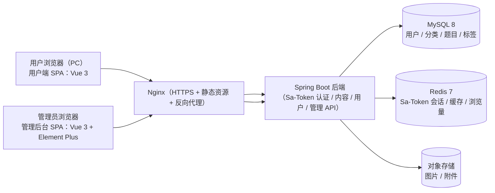

# 面试题知识库网站 — 整体方案（PC 端 · Java 前后端分离）

> 定位：对标 [小林coding](https://xiaolincoding.com/) 的**面试题知识库部分**，做一个 PC 端的面试题分类与展示网站。架构为**前后端分离**：前端展示内容，后端负责业务逻辑，管理后台主要负责**账号（登录用户）管理**，认证使用 **Sa-Token**。

---

## 一、项目定位与范围

三个部分各司其职：

- **用户端（前端展示）**：面试题分类、题目列表、答案详情，面向所有访客；支持注册登录。
- **后端（业务逻辑）**：内容管理、用户认证与授权、数据统计，提供 REST API。
- **管理后台（账号管理为核心）**：管理员登录后，主要管理**用户账号**（查询、禁用、重置密码、角色分配），并提供内容管理功能。

**明确不做（当前阶段）**：AI 问答、语音输入/输出、移动端/小程序、站内搜索、积分/会员体系、训练营/课程/求职工具。

---

## 二、用户身份与权限

| 身份 | 权限 | 登录 |
|---|---|---|
| 管理员 | 管理后台：账号管理（用户增删改查、禁用/启用、重置密码）、内容管理、统计 | 需要（账号密码） |
| 注册用户 | 登录后可浏览内容（只读），可修改个人密码 | 需要（注册后） |
| 游客 | 只读浏览公开内容 | 不需要 |

权限规则：**内容读取公开；写操作只对管理员开放；账号相关操作归属个人 + 管理员**。

---

## 三、核心功能

### 用户端（前端展示）

- 分类树导航（左侧固定侧边栏，支持多级分类）。
- 题目列表页：按分类查看，支持按标签/难度筛选、分页。
- 题目详情页：Markdown 答案正文、代码高亮、图解、目录（TOC）、上一篇/下一篇、相关题目。
- 注册 / 登录 / 退出。
- 个人中心：修改密码（查看个人信息）。

### 后端（Spring Boot，业务逻辑）

- 内容 API：分类、题目、标签的查询与管理接口。
- 用户 API：注册、登录、个人信息、密码修改。
- 管理 API：用户管理、内容管理、统计。
- 认证授权：Sa-Token，接口按"公开 / 登录用户 / 管理员"分级。

### 管理后台（账号管理为核心）

- **账号管理（重点）**：用户列表与搜索、查看详情、禁用/启用、重置密码、角色分配、删除。
- 内容管理：分类、题目、标签的增删改；Markdown 批量导入。
- 数据统计：用户数、题目数、浏览量 Top 10（简单看板）。

---

## 四、整体架构



**关键设计决策**：

- **前后端彻底分离**：用户端和管理后台都是 Vue 3 SPA，只通过 REST API 与 Spring Boot 通信；后端不关心页面长什么样，只负责业务逻辑与数据。
- **一个后端服务**：用户端、管理端共用一个 Spring Boot 后端，通过 Sa-Token 的登录身份与角色区分权限，避免维护两套后端。
- **账号管理是后台第一优先级**：后台首先做用户管理（列表、禁用、角色），内容管理作为第二模块。
- 内容以 **Markdown 为源**：后端存 Markdown，渲染 HTML（消毒后）返回给前端展示。

---

## 五、技术栈选型

| 层次 | 选型 | 说明 / 理由 | 备选 |
|---|---|---|---|
| 语言 | Java 17（或 21 LTS） | 生态成熟、资料多 | Kotlin |
| 后端框架 | Spring Boot 3（Spring MVC） | Java Web 事实标准 | Quarkus |
| 认证授权 | **Sa-Token** | 轻量国产框架，前后端分离友好，支持踢人下线、角色权限、Redis 会话存储，开箱即用 | Spring Security |
| ORM | MyBatis-Plus | CRUD 效率高、动态 SQL 方便 | JPA / JOOQ |
| 数据库 | MySQL 8 | 国内主流，数据模型简单够用 | PostgreSQL |
| 缓存 | Redis 7 + Spring Cache | Sa-Token 会话存储、页面/列表缓存、浏览量聚合 | Caffeine |
| 用户端前端 | Vue 3 + Vite + Vue Router + Pinia + Element Plus | 前后端分离展示内容；Element Plus 组件全 | React + Ant Design |
| 管理后台 | Vue 3 + Vite + Element Plus | 与用户端共用组件生态，开发快 | — |
| Markdown 渲染 | 后端 flexmark-java 渲染 HTML + OWASP 消毒，前端展示 | 渲染统一、防 XSS；前端只负责展示 | 前端 marked + DOMPurify |
| 代码高亮 | highlight.js（前端） | 轻量，支持绝大多数语言 | Shiki |
| 对象存储 | 本地目录起步 → 阿里云 OSS | 存配图/图解 | MinIO |
| 构建 | Maven（后端）/ Vite（前端） | 各自标准构建工具 | Gradle |
| 部署 | Docker Compose + Nginx + 阿里云 ECS | 两个 SPA 静态资源 + 后端 jar 同机部署 | 腾讯云 CVM |

### 选型理由速览

1. **为什么前后端分离？** 目标形态就是"前端展示 + 后端逻辑 + 独立管理后台"，分离后三端各自演进：前端只管渲染，后端只管数据与权限，后台只管运营管理。
2. **为什么 Sa-Token？** 比 Spring Security 轻量得多，中文文档全，注解式鉴权（`@SaCheckLogin` / `@SaCheckRole`）上手快；支持 Redis 会话存储和"踢人下线"，正好满足"管理员禁用用户后立即失效"的需求。
3. **为什么 Spring Boot + MySQL？** Java 生态最主流组合，招人、排障、云数据库都方便。
4. **SEO 的取舍**：纯 SPA 对搜索引擎不友好。若后续需要重点做 SEO，可将用户端升级为 Nuxt（Vue 的服务端渲染方案），后端 API 不变，只动前端。

---

## 六、数据模型设计

核心表如下（MySQL 8）：

```text
user                            -- 所有账号（管理员 + 普通用户）
  id BIGINT PK, username(唯一), password_hash(BCrypt),
  nickname, avatar, email,
  role("USER" / "ADMIN"),
  status(正常 / 禁用),
  last_login_at, created_at, updated_at

category
  id BIGINT PK, name, slug(唯一), parent_id(自关联),
  sort_order, description, created_at, updated_at

article                         -- 一道面试题 = 一篇文章
  id BIGINT PK, slug(唯一), title, summary,
  category_id(外键), difficulty(简单/中等/困难),
  status(草稿/已发布), content_md, content_html,
  view_count, created_by, created_at, updated_at

tag / article_tag               -- 标签，多对多

admin_log                       -- 管理操作日志
  id, admin_id, action, target_type, target_id, detail, created_at
```

题目示例（Markdown frontmatter）：

```markdown
---
title: TCP 为什么需要三次握手？
category: 计算机网络
tags: [TCP, 传输层]
difficulty: 中等
summary: 三次握手的必要性、防历史连接、序列号同步
---
## 一、三次握手的过程
...
```

---

## 七、权限与安全设计

- **认证**：注册/登录后由 Sa-Token 签发 token，前端在请求头携带；token 会话存 Redis，支持服务端主动失效。
- **接口分级**：
  - 公开接口：内容查询（`GET /api/articles/**`、`GET /api/categories`）。
  - 登录接口：个人信息、密码修改（`/api/user/**`，`@SaCheckLogin`）。
  - 管理接口：用户管理、内容管理、统计（`/api/admin/**`，`@SaCheckRole("ADMIN")`）。
- **账号管理能力**：管理员禁用用户后，调用 Sa-Token 将该用户会话**踢下线**，立即失效；重置密码走管理员操作。
- **密码安全**：BCrypt 哈希；登录/注册接口限流防爆破。
- **XSS 防护**：Markdown 渲染后的 HTML 过 OWASP HTML Sanitizer。
- **操作日志**：管理员的增删改全部写入 `admin_log`。
- **删除保护**：删除分类前校验无子分类和题目；删除用户可改为"禁用"而非物理删除。

---

## 八、管理后台功能清单（账号管理为核心）

| 模块 | 功能 | 优先级 |
|---|---|---|
| 登录 | 管理员账号密码登录（Sa-Token）、退出 | P0 |
| **账号管理** | 用户列表（搜索/分页）、查看详情、禁用/启用、重置密码、角色分配、删除 | P0 |
| 内容管理 | 分类管理（增删改排序）、题目管理（Markdown 编辑 + 预览、发布/下架、删除）、批量导入、标签管理 | P0 |
| 数据统计 | 用户数、题目数、发布数、浏览量 Top 10 | P1 |
| 操作日志 | 查看管理员操作记录 | P1 |

---

## 九、用户端展示细节（Vue 3 SPA）

### 布局（PC 优先）

```text
┌────────────────────────────────────────────┐
│ 顶栏：Logo / 导航（分类下拉,针对题目类别）/ 登录入口          │
├──────────┬─────────────────────────────────┤
│ 侧边栏    │  面包屑 + 题目列表               │
│ 分类树    │  （标题 / 摘要 / 难度 / 标签）      │
│          ├─────────────────────────────────┤
│          │  分页                            │
└──────────┴─────────────────────────────────┘

题目详情页：左侧 TOC 目录 | 中间正文 | 右侧相关题目
```

### 数据流

```text
用户端 Vue 3 ──GET /api/articles/:slug──▶ Spring Boot
                ◀── JSON（content_html 已渲染消毒）──
前端直接展示 HTML + highlight.js 高亮，不在前端渲染 Markdown
```

- 目录 TOC：后端渲染 HTML 时提取 h2/h3 生成锚点结构一并返回。
- 上一题/下一题、相关题目（同分类/同标签推荐）由后端接口提供。
- 浏览量：前端请求详情时后端计数（Redis 聚合，定时落库）。
- 登录用户请求自动携带 token；未登录游客照常浏览。

---

## 十、缓存与性能方案

| 层 | 缓存内容 | 实现 |
|---|---|---|
| 静态资源 | 两个 SPA 构建产物 | Nginx 直接托管 + CDN |
| 应用层 | 分类树、题目列表、热门题目 | Spring Cache（Redis） |
| 接口层 | 详情页 JSON | Redis，内容更新时失效 |
| Redis | Sa-Token 会话、浏览量计数 | Redis 7 |

**性能目标**：PC 端首屏 < 1s（SPA 首屏依赖静态资源速度，配 CDN 后没问题）；接口响应 < 100ms（走缓存）。

---

## 十一、部署与运维

### 起步（单机）

```text
阿里云 ECS 2核4G（约 100~300 元/月）
├─ Docker Compose
│  ├─ backend（Spring Boot jar）
│  ├─ mysql 8
│  ├─ redis 7
│  └─ nginx（托管 user-web / admin-web 静态资源 + 反代 /api）
├─ 备份：mysqldump 定时上传 OSS
└─ 初始化：首次启动执行 SQL 种子脚本创建管理员账号
```

- 前端构建产物 `dist/` 挂载进 Nginx 镜像；后端仅暴露 `/api/**`。
- 域名需 **ICP 备案**（国内上线）。
- 监控：Spring Boot Actuator + UptimeRobot + 日志。

---

## 十二、开发路线图

### M1：项目骨架 + 用户端内容展示（第 1~2 周）

- 后端：Spring Boot 3 初始化、数据建模（user/category/article/tag）、公开内容 API。
- 用户端：Vue 3 项目初始化，分类树、题目列表、详情页（HTML 展示 + 高亮 + TOC）。
- 种子数据 50~100 道题。

### M2：注册登录 + 管理后台账号管理（第 3~4 周）

- 后端：接入 Sa-Token，注册/登录/退出、接口分级鉴权（公开 / 登录 / 管理员）。
- 管理后台：登录、**用户管理**（列表、搜索、详情、禁用/启用、重置密码、角色分配）。
- 个人中心：修改密码。

### M3：内容管理与上线（第 5~6 周）

- 管理后台：内容管理（分类/题目 CRUD、Markdown 批量导入、标签管理）。
- 统计看板、管理操作日志、浏览量统计。
- Docker Compose 部署上线，备份脚本。

### 后续扩展（暂缓，不阻塞）

- AI 问答、移动端适配。

---

## 十三、成本估算（起步阶段）

| 项目 | 月成本（约） | 备注 |
|---|---:|---|
| ECS 2核4G | 100~300 元 | 单机 Docker Compose |
| 域名 | 60 元/年 | 需 ICP 备案 |
| 对象存储 | 0~30 元 | 图片量小 |
| 其他 | ~0 元 | 无第三方付费 API |

**合计约 100~330 元/月**，几乎全部是服务器成本。

---

## 十四、风险与应对

| 风险 | 应对 |
|---|---|
| SPA 的 SEO 弱 | 当前以功能和体验优先；后续要 SEO 可将用户端升级为 Nuxt（后端 API 不变） |
| 内容版权 | 题目答案尽量原创撰写或获得授权 |
| 后台安全 | 仅管理员可写、BCrypt、登录限流、禁用即踢下线、操作日志、HTML 消毒 |
| 用户数据安全 | 密码哈希、接口权限分级、敏感操作留痕 |
| 数据丢失 | MySQL 定时备份到 OSS，内容以 Git 版本管理 |

---

## 十五、MVP 落地建议

先跑通最小闭环再扩展：

1. **内容闭环**：用户端分类 → 题目列表 → 详情页，用 50~100 道高质量面试题验证内容管道。
2. **账号闭环**：用户注册登录（Sa-Token）+ 管理后台账号管理（列表、禁用、重置密码）。
3. **上线**：Docker 部署 + 备份，再考虑内容管理增强、统计等。

**一句话总结**：Vue 3 用户端（展示）+ Spring Boot（业务逻辑）+ Vue 3 管理后台（账号管理为核心），认证用 Sa-Token，MySQL + Redis，Docker 单机部署，6 周内可上线内测版。
